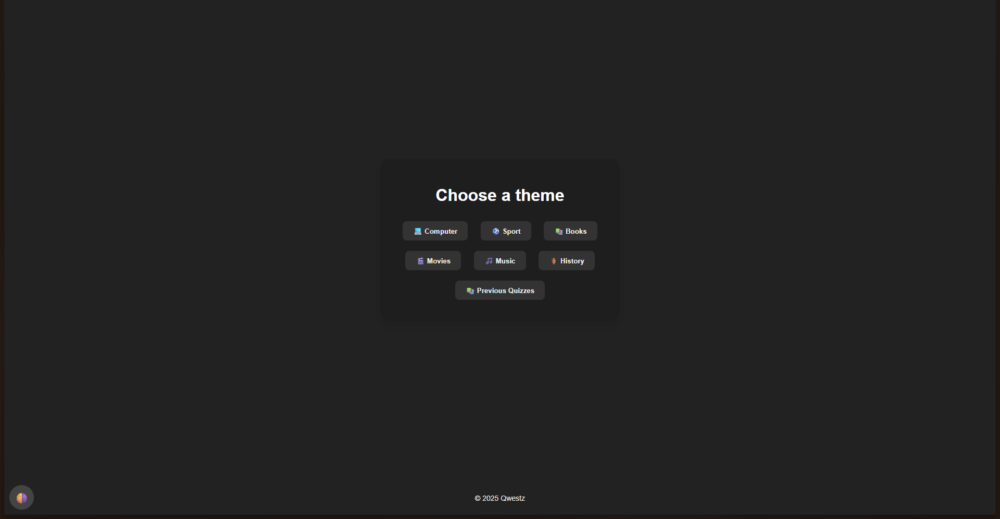
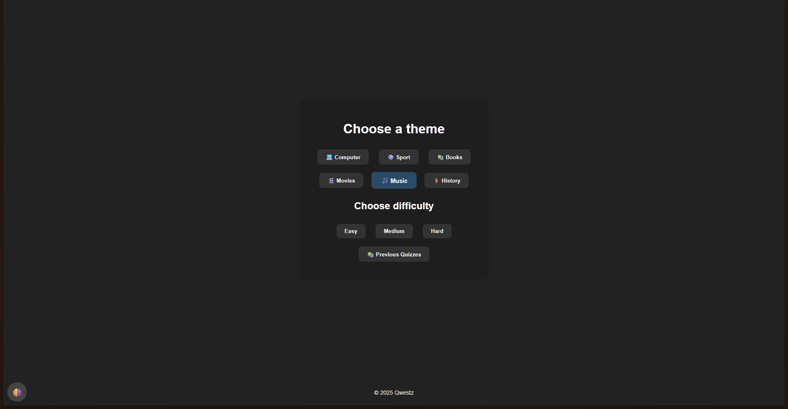
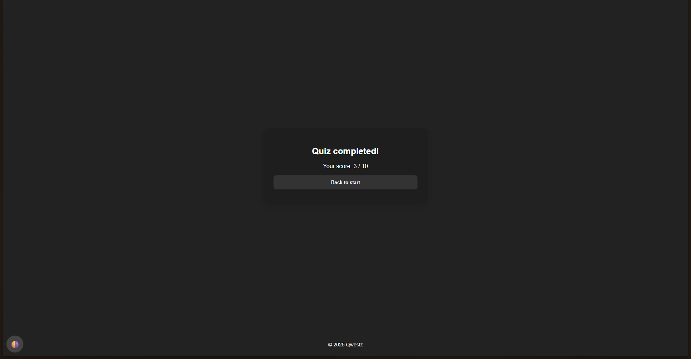
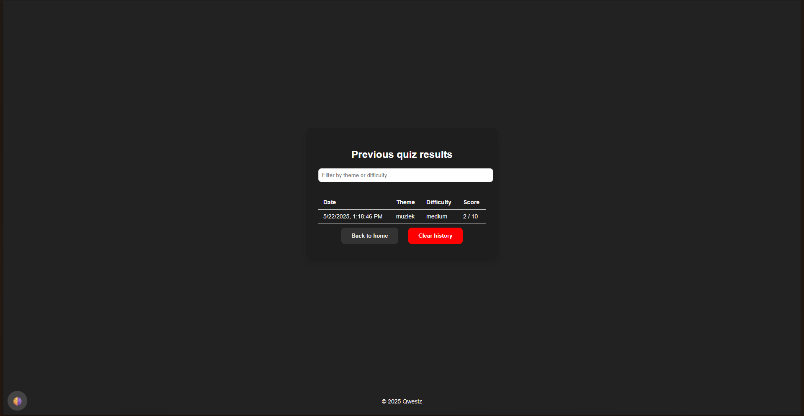

# Qwestz - Interactieve Quiz Applicatie

## 📋 Projectbeschrijving

Qwestz is een moderne quiz applicatie waarin gebruikers kunnen kiezen uit verschillende thema's (Computer, Sport, Boeken, Films, Muziek, Geschiedenis) en moeilijkheidsgraden (Easy, Medium, Hard). De applicatie houdt een geschiedenis bij van alle gemaakte quizzen en ondersteunt zowel light als dark mode.

## 📊 Hoofdfunctionaliteiten

- **Thema selectie**: 6 verschillende quiz categorieën
- **Moeilijkheidsgraad**: 3 niveaus per thema
- **Quiz geschiedenis**: Overzicht van alle gemaakte quizzen met filter functionaliteit
- **Dark/Light mode**: Gebruikersvoorkeur wordt opgeslagen
- **Responsive design**: Werkt op desktop en mobiele apparaten
- **Single-page application**: Smooth navigatie zonder pagina herladingen

## 🌐 Gebruikte API's

**Open Trivia Database API**: https://opentdb.com/api.php
- Hoofdeindpunt voor quiz vragen
- Parameters: amount, category, difficulty, type
- Gratis API zonder authenticatie vereist
- Documentatie: https://opentdb.com/api_config.php

## 🚀 Installatiehandleiding

### Vereisten

- Node.js (versie 18 of hoger)
- NPM of Yarn package manager

### Installatie Stappen

1. **Clone de repository**
```bash
git clone https://github.com/Brend-VanDenEynde/Project-Web-Advanced
cd qwestz
```

2. **Installeer dependencies**
```bash
npm install
```

3. **Start de development server**
```bash
npm run dev
```

4. **Open in browser**
    - Navigeer naar http://localhost:5173
    - De applicatie is nu beschikbaar

### Build voor productie

```bash
npm run build
npm run preview
```

## 🛠️ Technische Implementatie

### 📦 DOM Manipulatie

**Elementen selecteren:**
- `document.getElementById()` – Lijn **11**, **213**, **344** (`main.js`)
- `document.querySelectorAll()` – Lijn **333**, **360** (`main.js`)

**Elementen manipuleren:**
- `innerHTML` – Lijn **29**, **90**, **138**, **209**, **247**, **291** (`main.js`)
- `classList.add/remove/toggle` – Lijn **9**, **13**, **335**, **339** (`main.js`)

**Events koppelen:**
- `addEventListener()` – Lijn **16**, **213**, **345**, **361**, **388** (`main.js`)

---

### ⚙️ Modern JavaScript

- **Constanten**: `const` gebruikt op o.a. lijn **6**, **10**, **11**, **333** (`main.js`)
- **Template literals**: `` `${}` `` syntax – Lijn **29**, **92**, **209**, **246**, **291** (`main.js`)
- **Array iteratie**:
  - `forEach()` – Lijn **333**, **360**, **388** (`main.js`)
  - `map()` – Lijn **246**, **251** (`main.js`)
- **Arrow functions**: `() => {}` – Lijn **16**, **213**, **336**, **361**, **388** (`main.js`)
- **Callback functions**: Gebruikt in event listeners – Lijn **213**, **336**, **388** (`main.js`)
- **Async & Await**: `async/await` – Lijn **109–123** (`main.js`)

---

### 📡 Data & API

**Fetch & API calls (Open Trivia DB)**:
- Fetch: Lijn **109** (`main.js`)
- `res.json()` – Lijn **110** (`main.js`)
- Foutafhandeling (`try/catch`) – Lijn **108–123** (`main.js`)

**JSON manipulatie**:
- `JSON.parse()` – Lijn **268**, **296** (`main.js`)
- `JSON.stringify()` – Lijn **273** (`main.js`)

---

### 💾 Opslag & Validatie

**LocalStorage**:
- Thema opslag: Lijn **11**, **339** (`main.js`)
- Quiz geschiedenis: Lijn **268**, **273** (`main.js`)
- Gebruikersvoorkeuren: Lijn **344**, **345** (`main.js`)

**Formulier validatie**:
- Thema/difficulty check bij ontbreken: Lijn **99–101** (`main.js`)
- Input validatie (filteren op resultaten): Lijn **361–366** (`main.js`)

---

### 🎨 Styling & Layout

**Flexbox Layout**:
- Hoofdlayout (`body`): Lijn **1–9** (`style.css`)
- Quizvragen (`.answers`): Lijn **109–111** (`style.css`)

**CSS Transitions**:
- Toegepast op: `body`, `.app-btn`, `.card`, `#dark-mode-toggle`, `.footer`, `#difficulty-section`  
- Lijnen **4**, **16**, **33**, **55**, **68**, **89** (`style.css`)

**Responsive Design**:
- Percentagebreedtes en flexbox: Lijn **10–14**, **54–56** (`style.css`)

**Dark Mode**:
- Implementatie voor body, knoppen, kaarten, footer:  
- Lijn **17–18**, **22–23**, **38–40**, **57–60**, **72–75** (`style.css`)


### Tooling & Structuur

**Vite Setup**: index.html met ES6 modules  
**Router Implementatie**: router.js - Hash-based routing  
**Folderstructuur**:
```
/
├── index.html
├── src/
│   ├── main.js
│   ├── router.js
│   ├── style.css
│   └── img/
└── package.json
```

## 📱 Screenshots










## 🔧 Gebruikte Bronnen

### APIs
- Open Trivia Database: https://opentdb.com/


### Libraries & Tools
- Vite: development server
- Vanilla JavaScript: Geen externe framework gebruikt

### AI gebruik
- HTML Entity Decoding functie: ChatGPT gegenereerd (main.js)
- Setup Theme Buttons : ChatGPT gegenereerd (main.js)
- CSS Animatie voor difficulty section: AI-Bot assistentie (style.css)
- Bij bepaalde errors heb ik gebruik gemaakt van de Github Copilot in VS code
- Design van de readme + ook bepaalde zaken binnen de readme geschreven
- Animaties in de css. Gemaakt door Copilot

## Auteur
Brend Van Den Eynde